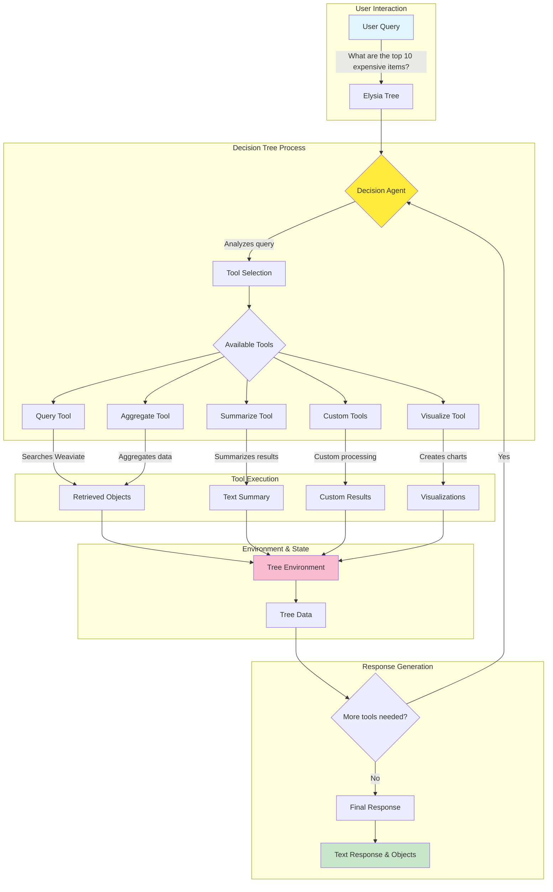

# Elysia: A Comprehensive Overview

## What is Elysia?

Elysia is an **agentic framework powered by decision trees** that dynamically selects and executes tools based on context and environment. It's designed to provide intelligent, context-aware data retrieval and processing, with built-in support for Weaviate vector databases.

### Key Features

- 🤖 **Agentic Decision Making**: Uses LLMs to intelligently choose which tools to execute
- 🌳 **Decision Tree Architecture**: Organizes tools in a hierarchical structure for efficient navigation
- 🔧 **Extensible Tool System**: Easy-to-create custom tools using simple Python decorators
- 📊 **Weaviate Integration**: Pre-built tools for querying and aggregating data from Weaviate clusters
- 🌐 **Web Application**: Includes a React-based frontend for interactive use
- 🔄 **Async-First Design**: Built for performance with async/await patterns throughout

## How Elysia Works: Step-by-Step

### 1. Core Architecture

Elysia operates on a decision tree model with three main components:

```
┌─────────────────┐
│ Decision Agent  │ ← Chooses tools based on context
└────────┬────────┘
         │
┌────────▼────────┐
│   Tool Tree     │ ← Hierarchical organization of tools
└────────┬────────┘
         │
┌────────▼────────┐
│  Environment    │ ← Stores results and state
└─────────────────┘
```

### Visual Flow Diagram



### 2. Basic Workflow

Here's how to get started with Elysia in just a few steps:

#### Step 1: Installation
```bash
pip install elysia-ai
```

#### Step 2: Configuration
```python
from elysia import configure

configure(
    base_model="gpt-4o-mini",      # Fast model for decisions
    base_provider="openai",         
    complex_model="gpt-4o",         # Powerful model for complex tasks
    complex_provider="openai",
    openai_api_key="sk-...",        # Your API keys
    wcd_url="...",                  # Weaviate cluster URL
    wcd_api_key="..."               # Weaviate API key
)
```

#### Step 3: Create a Simple Tool
```python
from elysia import tool, Tree

tree = Tree()

@tool(tree=tree)
async def calculate(x: int, y: int, operation: str = "add") -> int:
    """
    Performs basic mathematical operations on two numbers.
    """
    if operation == "add":
        return x + y
    elif operation == "multiply":
        return x * y
    elif operation == "subtract":
        return x - y
```

#### Step 4: Use the Tree
```python
response, objects = tree("What is 15 multiplied by 23?")
print(response)  # The agent will use your calculate tool
```

### 3. Working with Weaviate Data

Elysia shines when working with vector databases:

#### Step 1: Preprocess Your Collection
```python
from elysia import preprocess

# Analyze your Weaviate collection for optimal querying
preprocess("MyCollection")
```

This preprocessing step:
- Analyzes the schema and data structure
- Generates field summaries using LLMs
- Creates mappings for different display types
- Stores metadata for efficient querying

#### Step 2: Query Your Data
```python
tree = Tree()
response, objects = tree(
    "Find the top 5 most expensive products in electronics category",
    collection_names=["Products"]
)
```

### 4. Decision Tree Process

Here's what happens when you make a query:

1. **Prompt Analysis**: The decision agent analyzes your query
2. **Tool Selection**: Based on available tools and context, it selects the appropriate tool
3. **Parameter Assignment**: The LLM determines the correct parameters for the tool
4. **Tool Execution**: The tool runs asynchronously and returns results
5. **Environment Update**: Results are stored in the tree's environment
6. **Iteration**: The process repeats if more tools are needed
7. **Response Generation**: Final response is compiled from all tool outputs

### 5. Advanced Features

#### Custom Tool with Error Handling
```python
from elysia import tool, Error

@tool
async def fetch_data(url: str) -> dict:
    """Fetches data from an API endpoint."""
    try:
        # Your API call logic here
        if not url.startswith("https://"):
            yield Error("URL must use HTTPS")
            return
        
        # Simulated API response
        data = {"status": "success", "data": [1, 2, 3]}
        yield data
        yield f"Successfully fetched data from {url}"
    except Exception as e:
        yield Error(f"Failed to fetch data: {str(e)}")
```

#### Tool with Tree Data Access
```python
@tool
async def analyze_context(
    tree_data,      # Automatically injected
    base_lm,        # Access to base language model
    query: str
):
    """Analyzes the current context and query."""
    # Access environment data
    previous_results = tree_data.environment.results
    
    # Use the language model
    analysis = await base_lm.generate(f"Analyze: {query}")
    
    yield {"analysis": analysis, "context_size": len(previous_results)}
```

### 6. Web Application

Run the Elysia web app:
```bash
elysia start
```

Then navigate to `http://localhost:8501` to:
- Configure API keys and models
- Manage Weaviate collections
- Create and test queries interactively
- View tool execution traces

### 7. Built-in Tools

Elysia comes with several pre-built tools:

- **Query Tool**: Searches Weaviate collections with filters and sorting
- **Aggregate Tool**: Performs aggregations on collection data
- **Summarize Tool**: Creates summaries of retrieved objects
- **Text Response Tool**: Generates natural language responses
- **Visualize Tool**: Creates data visualizations (charts, graphs)

## Best Practices

1. **Tool Design**
   - Keep tools focused on a single task
   - Provide detailed docstrings for better tool selection
   - Use type hints for parameter clarity

2. **Preprocessing**
   - Always preprocess collections before querying
   - Use appropriate sample sizes based on your data

3. **Error Handling**
   - Use the `Error` class for graceful error handling
   - Let the decision agent retry with different parameters

4. **Performance**
   - Tools are async by default - leverage this for parallel operations
   - Use the base model for simple decisions, complex model for analysis

## Example: Complete Workflow

```python
from elysia import Tree, tool, configure, preprocess

# 1. Configure Elysia
configure(
    base_model="gpt-4o-mini",
    base_provider="openai",
    complex_model="gpt-4o",
    complex_provider="openai",
    openai_api_key="your-key-here"
)

# 2. Create a tree
tree = Tree()

# 3. Add a custom tool
@tool(tree=tree)
async def analyze_sentiment(text: str) -> dict:
    """Analyzes the sentiment of the provided text."""
    # Your sentiment analysis logic here
    return {
        "text": text,
        "sentiment": "positive",
        "confidence": 0.85
    }

# 4. Preprocess your Weaviate data
preprocess("CustomerReviews")

# 5. Use Elysia
response, objects = tree(
    "Find negative customer reviews from last month and analyze their sentiment",
    collection_names=["CustomerReviews"]
)

print(response)
# Elysia will:
# 1. Query CustomerReviews for recent data
# 2. Filter for negative reviews
# 3. Apply your sentiment analysis tool
# 4. Summarize the results
```

## Quick Reference

### Essential Commands
```python
# Import Elysia
from elysia import Tree, tool, configure, preprocess

# Configure models
configure(base_model="gpt-4o-mini", complex_model="gpt-4o", ...)

# Create a tree
tree = Tree()

# Add a tool
@tool(tree=tree)
async def my_tool(param: str) -> str:
    """Tool description"""
    return f"Result: {param}"

# Preprocess collection
preprocess("CollectionName")

# Query data
response, objects = tree("Your query", collection_names=["Collection"])
```

### Common Patterns
```python
# Tool with error handling
@tool
async def safe_tool(x: int) -> int:
    if x < 0:
        yield Error("Value must be positive")
        return
    yield x * 2

# Tool accessing tree data
@tool
async def context_aware_tool(tree_data, query: str):
    previous = tree_data.environment.results
    # Use previous results...

# Tool with multiple outputs
@tool
async def multi_output_tool(data: str):
    yield {"analysis": "some analysis"}
    yield "User-friendly message"
    yield Result({"detailed": "results"})
```

### Environment Variables
```bash
# Required for Weaviate integration
WCD_URL=https://your-cluster.weaviate.network
WCD_API_KEY=your-weaviate-key

# Required for LLMs
OPENAI_API_KEY=sk-...
# OR
OPENROUTER_API_KEY=sk-or-...

# Optional
ANTHROPIC_API_KEY=...
COHERE_API_KEY=...
```

## Your Quick Setup

With your Weaviate credentials, here's the fastest way to get started:

```python
from elysia import configure, Tree

# Configure with your credentials
configure(
    base_model="gpt-4o-mini",
    base_provider="openai",
    wcd_url="https://xgsf87xst2qd5bjgbh54ba.c0.us-west3.gcp.weaviate.cloud",
    wcd_api_key="<YOUR-WEAVIATE-API-KEY>",
    openai_api_key="sk-YOUR-OPENAI-KEY"  # Get from platform.openai.com
)

tree = Tree()
response, objects = tree("Your query here")
```

## Summary

Elysia transforms how you interact with data by:
- **Intelligently selecting** the right tools for your query
- **Chaining operations** to answer complex questions
- **Learning from context** to provide better results
- **Integrating seamlessly** with Weaviate vector databases

Whether you're building a chatbot, analyzing data, or creating complex workflows, Elysia provides the agentic intelligence to make your applications smarter and more responsive.
